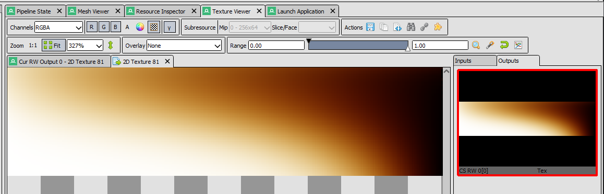
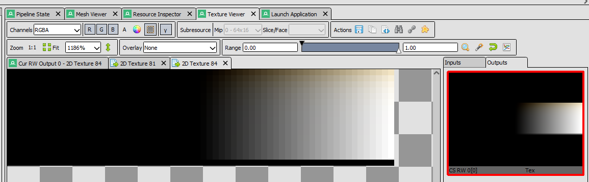
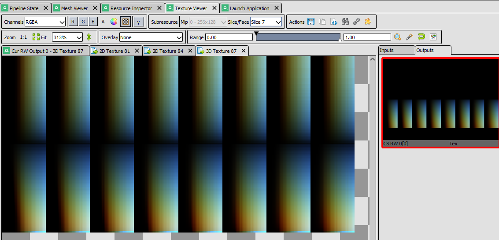

# rust_d3d11

## Features
- A decent start at a clean design encapsulating a render pass. 
    - The idea is to describe the render pass in terms of its pipeline state and the attachments, both input and output, required. This way we can provide the scene data required and easily render a complex pass.
    - It's still not perfect, but I'll be improving it once I finish atmospheric rendering. This will give me a chance to properly design the compute shader interface for these passes using the lessons learned from the implementation.

## Status
Currently very in-development!

I'm in the middle of implementing Eric Bruneton and Fabrice Neyret's [Precomputed Atmospheric Scattering](https://hal.inria.fr/inria-00288758/document) paper.

You can watch a presentation I gave on the topic here: https://youtu.be/daLR1ngxOkk

So far, I'm generating the Trasmittance, Direct Irradiance, and Single In-Scattering look up tables.

### Transmittance

### Direct Irradiance

### Single In-Scattering

